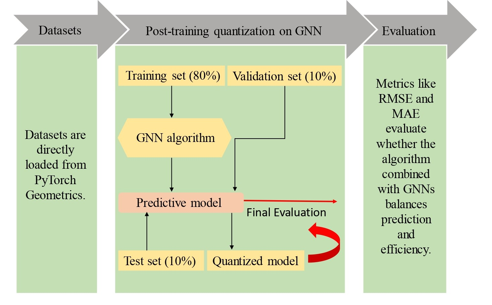

# Enhancing molecular property prediction with quantized GNN models

## 📌 Summary
This paper integrates DoReFa-Net quantization with GNNs to improve computational and storage efficiency in molecular property prediction. Results show that GCN models maintain comparable performance up to INT8 quantization, while GIN models are less robust. However, 4-bit and 2-bit quantization significantly degrade performance. Overall, INT8 quantization offers a good balance between computational efficiency and predictive accuracy.

### 🎯 Goal:
To develop lightweight and computationally efficient GNN models through quantization while maintaining reliable molecular property prediction performance.

---

<div align="center">
  
</div>

---


## ⚙️ Installation & Setup

###  💻 Google Colab (Recommended)

```bash
!pip install torch_geometric
!pip install rdkit
```

### Train/test quant_molecular_networks:
  
 Run train.py using
```bash
  `python train.py`  
```
## 📊 Datasets

🌐 Public dataset used in this work: https://moleculenet.org/datasets-1 

## 📄 Published Paper

<p align="center"> <a href="https://link.springer.com/article/10.1186/s13321-025-00989-3" target="_blank">  </a> </p>


## 📚 Citation

If you use this work in your research, please cite the following paper:

Rasool, A., Ul Rahman, J., & Uwitije, R. (2025). Enhancing molecular property prediction with quantized GNN models. *Journal of Cheminformatics*, 17(1), 81. DOI: https://doi.org/10.1186/s13321-025-00989-3 

